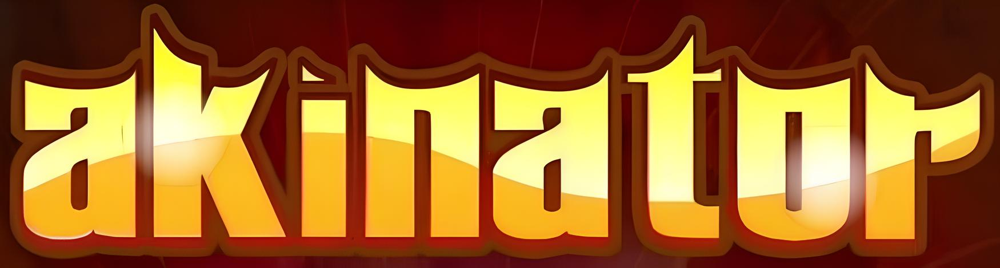
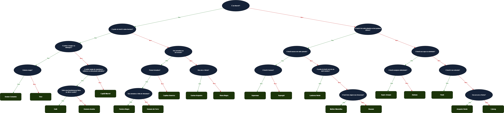
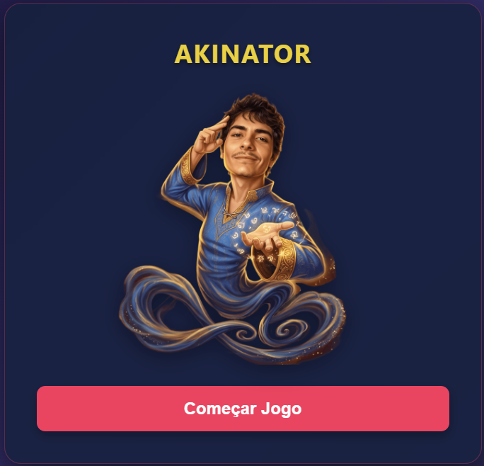
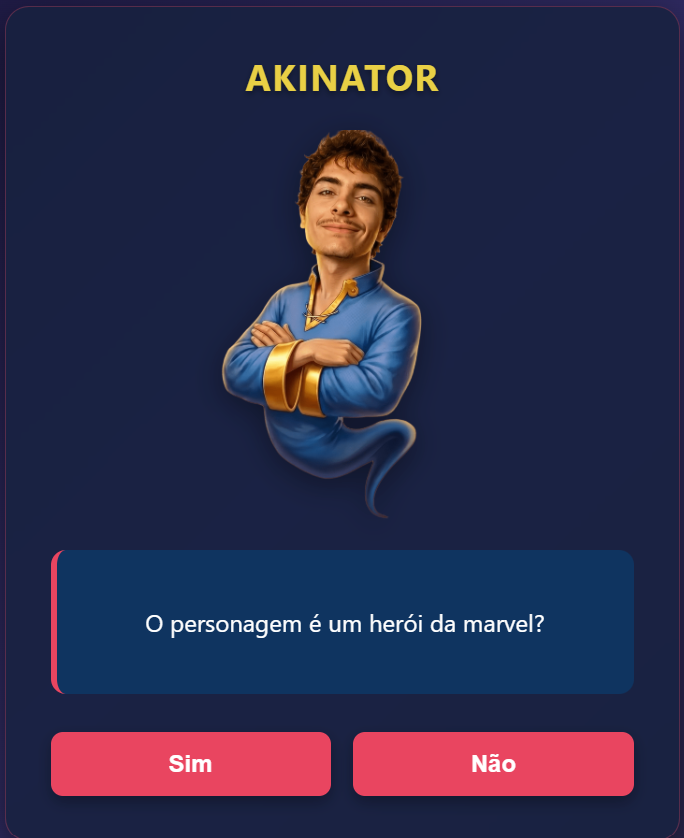

# 🧞 Akinator Simplificado

Réplica simplificada do famoso jogo de adivinhação **Akinator**, desenvolvida em **HTML, CSS e JavaScript puro**. O projeto foi um desafio proposto pelo professor da disciplina de **Inteligência Artificial** (6° período de Ciência da Computação): usar uma **árvore binária de decisão** para "adivinhar" em qual herói da Marvel ou da DC o jogador está pensando, a partir de perguntas de Sim/Não.

<div align="center">
  
</div>

## 🎯 Objetivos

Os principais objetivos do projeto foram:

- Aplicar na prática os conceitos de **árvores de decisão** e **sistemas especialistas**, vistos na disciplina de IA.
- Entender a diferença entre a IA clássica e dedutiva do Akinator original e as IAs generativas atuais.
- Praticar **orientação a objetos** em JavaScript (classes, herança) e manipulação de DOM.

## 🕹️ Sobre o projeto

O jogador pensa em um herói e vai respondendo **Sim** ou **Não** às perguntas exibidas na tela. Cada resposta move a navegação para o galho esquerdo (Sim) ou direito (Não) da árvore, até chegar a um nó-folha, onde o "gênio" revela seu palpite final acompanhado de um GIF do personagem.

A árvore é composta por **20 heróis** (10 da Marvel e 10 da DC), organizados por características como origem, tipo de poder, uso de armadura, entre outras.

| Marvel | DC |
| ------ | -- |
| Dr. Estranho | Superman |
| Thor | Supergirl |
| Hulk | Lanterna Verde |
| Homem-Aranha | Mulher Maravilha |
| Capitã Marvel | Shazam |
| Pantera Negra | Super-Choque |
| Homem de Ferro | Batman |
| Capitão América | Flash |
| Gavião Arqueiro | Arqueiro Verde |
| Viúva Negra | Cyborg |

## 🌳 Como funciona a árvore de decisão

O raciocínio do jogo é modelado como uma **árvore binária estática**, onde cada pergunta é um nó com dois caminhos possíveis:



&nbsp;

- **Raiz:** primeira pergunta do jogo (*"O personagem é um herói da Marvel?"*);
- **Nós:** perguntas intermediárias que vão refinando a busca;
- **Folhas:** resultado final, com o palpite do herói e seu GIF.


Duas classes em JavaScript representam essa estrutura:

```js
class No {
    constructor(valor, imagem, esquerda, direita) {
        this.valor = valor;
        this.imagem = imagem;
        this.esquerda = esquerda;
        this.direita = direita;
    }
}

class NoFolha extends No {
    constructor(valor, imagem) {
        super(valor);
        this.imagem = imagem;
    }
}
```

A função `responder()` é o motor central do jogo: a cada clique em Sim/Não, ela verifica se o nó atual é uma folha e, caso não seja, navega para `noAtual.esquerda` ou `noAtual.direita`, atualizando a tela com `atualizarTela()`.

### Exemplo de caminho — Dr. Estranho

| # | Pergunta | Resposta |
| - | -------- | -------- |
| 1 | É da Marvel? | Sim |
| 2 | O poder do herói é sobre-humano? | Sim |
| 3 | O poder é mágico ou mitológico? | Sim |
| 4 | Estudou magia? | Sim → **"Eu sei que você está pensando no Dr. Estranho!"** |

## ✨ Funcionalidades

- Árvore binária com 20 personagens, cada um com sua própria imagem/GIF de revelação;
- Imagem do gênio muda conforme o andamento da árvore;
- Botões de Sim/Não que guiam a navegação até o resultado final;
- Tela inicial e botão de "Jogar Novamente" para reiniciar a árvore do zero;


## 🎮 Controles

| Ação | Botão |
| ---- | ----- |
| Iniciar o jogo | `Começar Jogo` |
| Responder afirmativamente | `Sim` |
| Responder negativamente | `Não` |
| Jogar novamente | `Jogar Novamente` |

## 🖼️ Telas do jogo

<table>
  <tr>
    <td align="center"><b>Tela inicial</b></td>
    <td align="center"><b>Pergunta (nó)</b></td>
    <td align="center"><b>Resultado (nó-folha)</b></td>
  </tr>
  <tr>
    <td></td>
    <td></td>
    <td></td>
  </tr>
</table>


## 📚 O que estudamos com esse projeto

- Modelagem de **sistemas especialistas** e **árvores de decisão** como abordagem clássica de IA;
- A diferença entre a IA do Akinator original — dedutiva e probabilística, que ajusta pesos de confiança conforme acerta ou erra, e a réplica aqui apresentada, que é **determinística** (cada pergunta e resultado são fixos);
- Orientação a objetos em JavaScript;
- Organização do fluxo do jogo em funções bem definidas: `iniciarJogo()`, `responder()`, `atualizarTela()` e `reiniciarJogo()`.

## ⚙️ Tecnologias

- **HTML5**
- **CSS3**
- **JavaScript** 

## ▶️ Como executar

1. Clone o repositório:
```bash
git clone <URL-DO-REPOSITORIO>
```
2. Entre na pasta `src`;
3. Abra o arquivo `index.html` diretamente no navegador 

## ⚠️ Limitações do modelo

Diferente do Akinator original, que é adaptativo e probabilístico, esta réplica é totalmente determinística:

- Base de personagens fixa (*hardcoded* no `script.js`);
- Sem aprendizado automático nem ajuste de pesos/confiança;
- Respostas limitadas a Sim/Não;
- Uma resposta "errada" desvia o caminho sem chance de correção;
- A ordem das perguntas é sempre a mesma.

## 🚧 Próximas melhorias

- Mover personagens e perguntas para um arquivo **JSON externo**, separando dados de lógica;
- Introduzir pesos e probabilidades, aproximando o comportamento do Akinator original;
- Guardar estatísticas/histórico de partidas com **localStorage**;
- Adicionar mais personagens e novos universos (animes, jogos, etc.).

## 👥 Colaboração

Projeto desenvolvido em dupla para a disciplina de Inteligência Artificial, apresentado em sala através de slides: 📽️ [Slides da apresentação](Slides_Akinator.pdf)

- [Ana Carolina Lino](https://github.com/Carolzita001)
- [Octavio Lamounier](https://github.com/OctavioSantosLamounier)


## 📌 Observação

Este projeto foi feito como atividade acadêmica, com o objetivo principal de **aprender e praticar** os conceitos de árvores de decisão e sistemas especialistas vistos na disciplina de Inteligência Artificial. Não há intenção de criar uma versão comercial — a ideia é usar essa réplica como laboratório de estudo sobre IA clássica, lógica de árvores binárias e orientação a objetos.

---

**Projeto desenvolvido em HTML, CSS e JavaScript como estudo de árvores de decisão e sistemas especialistas, para a disciplina de Inteligência Artificial.**